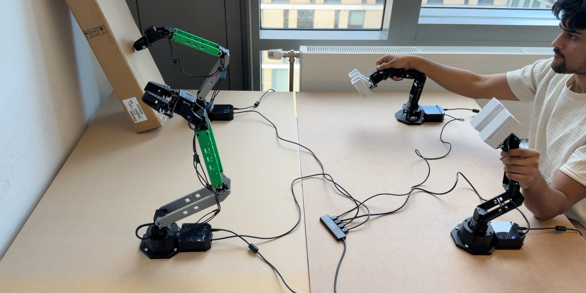

# Sensorless Bilateral Force Feedback for Low-Cost Scaled Teleoperation

A dual-pair bimanual teleoperation system that achieves bilateral force feedback using only motor current readings from commodity $27.50 Dynamixel servos, with custom 2x-scaled 3D-printed follower arms.

**[Paper](paper/preprint.pdf)** | **[Video](https://youtu.be/PqzKTUld3uw)** | **[Project Page](https://leocamacho.co/teleop)**



## Key Results

- **91.1% obstacle detection sensitivity** via sensorless force feedback (n=22 user study)
- **~$3,000 total cost** for the complete dual-pair system (10x cheaper than ALOHA)
- **55% motor cost savings** via torque-tiered actuator selection
- **7/7 median learnability** rating from novice users

## System Overview

| Component | Specification |
|-----------|---------------|
| Leaders (x2) | PincherX-100, all XL430-W250 motors, PWM mode (backdrivable) |
| Followers (x2) | Custom 2x-scaled, XM430-W210 (shoulder/elbow) + XL430-W250 (waist/wrist/gripper), position mode |
| Force feedback | Motor current as force proxy, 300 mA threshold, proportional PWM resistance |
| Software | ROS 2 Humble, 20 nodes across 4 namespaces, 100 Hz joint state publishing |
| Safety | Graceful shutdown (POSIX signal masking), smooth startup, gripper PWM limiting, invisible wall collision avoidance |

## Repository Structure

```
├── paper/                          # Preprint and figures
│   ├── preprint.tex                # LaTeX source
│   ├── preprint.pdf                # Compiled paper
│   ├── references.bib              # Bibliography
│   └── figures/                    # Paper figures
│
├── dissertation_ws/                # ROS 2 workspace
│   └── src/teleop_controller/
│       ├── teleop_controller/      # Python source
│       │   ├── teleop_node.py      # Joint-space teleoperation + collision avoidance
│       │   ├── force_feedback_node.py  # Sensorless bilateral force feedback
│       │   ├── motion_node.py      # Shared autonomy (RViz interactive markers)
│       │   └── effort_graph_node.py    # Real-time effort visualisation
│       ├── config/                 # Motor configs, teleop params, RViz config
│       ├── launch/                 # dual_arm_bringup.launch.py
│       └── urdf/                   # Scaled follower robot description
│
├── 3d-printing/                    # 3D printing files
│   ├── modified_arm/               # Custom 2x-scaled STLs (final versions)
│   │   ├── left-bicep.stl
│   │   ├── right-bicep.stl
│   │   ├── final-final-xl-forearm.stl
│   │   ├── left-final-gripper.stl
│   │   ├── right-final-gripper.stl
│   │   ├── left-finger-hold.stl
│   │   └── right-finger-hold.stl
│   └── px100-meshes/               # Original PincherX-100 reference meshes
│
└── identify_arms.py                # USB serial port identification utility
```

## Hardware Requirements

- 2x PincherX-100 Robot Arms (leaders)
- 4x XM430-W210 motors (follower shoulder + elbow)
- 6x XL430-W250 motors (follower waist + wrist + gripper)
- 4x U2D2 USB-to-serial adapters
- 12V power supply
- 3D-printed follower arm links (STLs in `3d-printing/modified_arm/`)

## Quick Start

### Prerequisites
- Ubuntu 22.04 with ROS 2 Humble
- [Interbotix XS SDK](https://docs.trossenrobotics.com/interbotix_xsarms_docs/)

### Set up USB latency and udev rules
```bash
python3 identify_arms.py
```

### Build and run
```bash
cd dissertation_ws
colcon build --packages-select teleop_controller
source install/setup.bash
ros2 launch teleop_controller dual_arm_bringup.launch.py
```

### Debug
```bash
ros2 node list
ros2 topic echo /leader_left/joint_states
ros2 topic echo /follower_left/joint_states
```

## Configuration

All teleoperation parameters are in `config/teleop_config.yaml`:

| Parameter | Default | Description |
|-----------|---------|-------------|
| `effort_threshold` | 300 mA | Effort below this is filtered |
| `pwm_scale` | 0.5 | Proportional gain for force feedback |
| `max_pwm` | 350 | Safety cap on leader resistance |
| `smoothing_alpha` | 0.15 | Exponential smoothing factor |
| `wall_threshold` | 0.0 m | Y-position of invisible wall |

## Citation

```bibtex
@article{camacho2026sensorless,
  title={Sensorless Bilateral Force Feedback for Low-Cost Scaled Teleoperation},
  author={Camacho Pel\'aez, Leonardo},
  institution={University of Edinburgh},
  year={2026}
}
```

## License

This project is open-source. Hardware designs (STL files) and software are provided for research and educational use.
